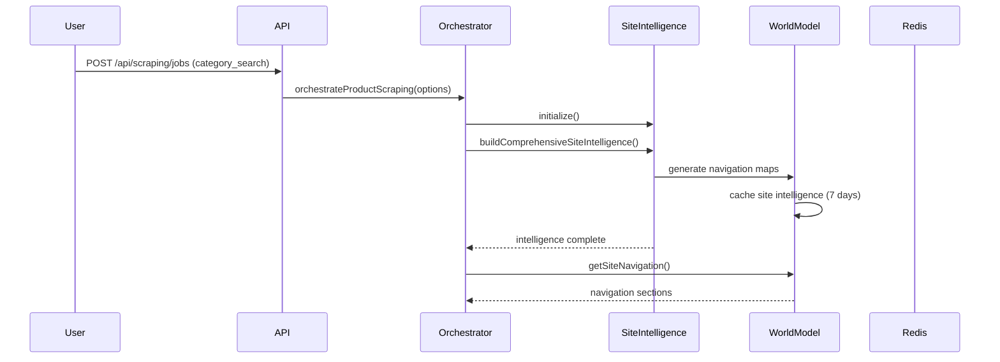
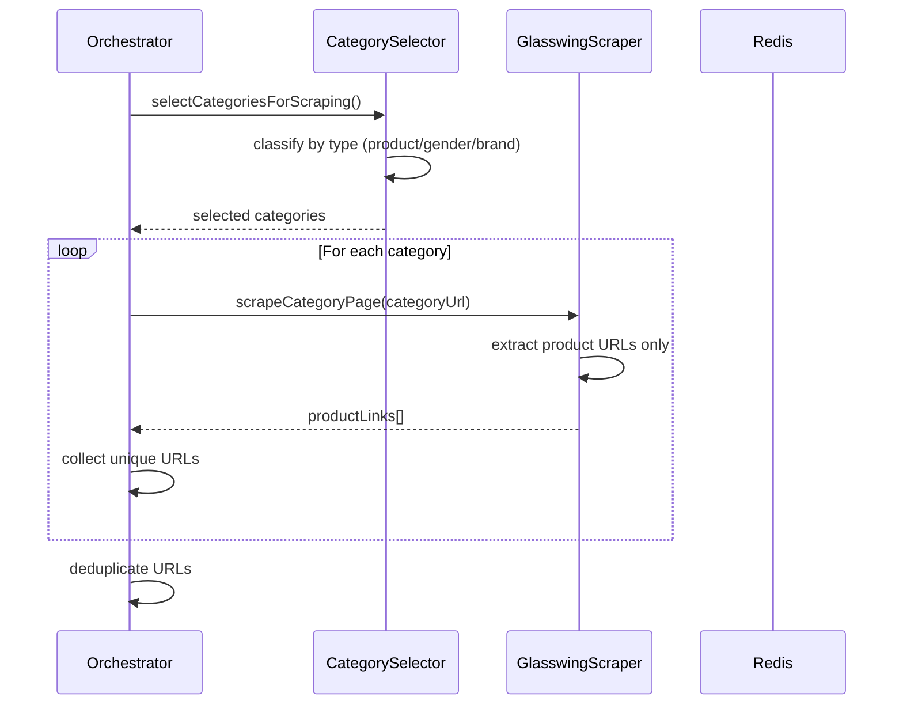
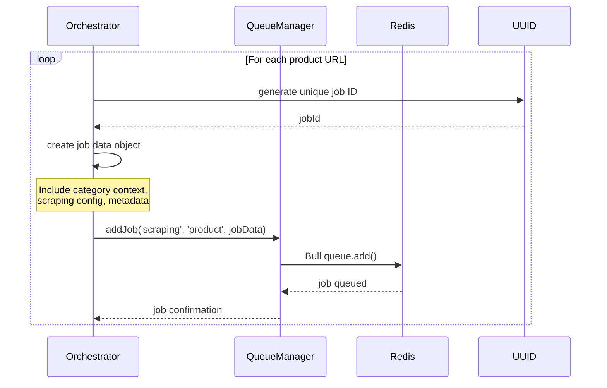
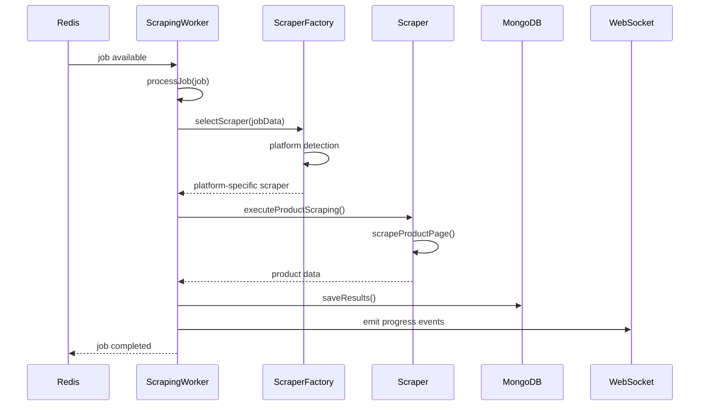
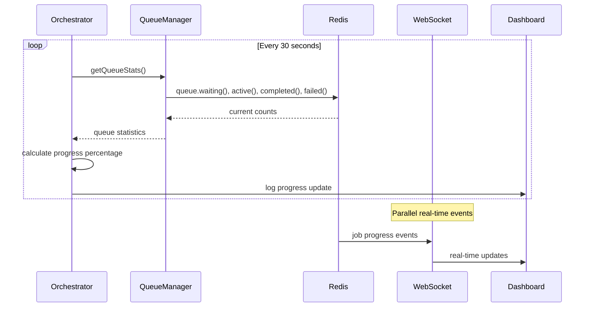

# REDIS QUEUE FLOW REQUIREMENTS
# Version 1.0 - Distributed Scraping Architecture

## 🎯 SYSTEM OVERVIEW

### Queue Architecture Purpose
Our Redis-based queue system orchestrates distributed scraping by separating discovery from extraction, allowing parallel processing of thousands of products while maintaining site intelligence and category relationships. The system transforms sequential scraping into massively parallel distributed jobs.

### Core Flow Principles
- **Separation of Concerns** - Discovery (find products) vs Extraction (scrape products)
- **Category-Aware Queuing** - Every job carries category context and relationships
- **Distributed Processing** - Multiple workers process jobs in parallel across machines
- **Fault Tolerance** - Jobs retry with exponential backoff and graceful failure handling
- **Progress Monitoring** - Real-time visibility into queue status and worker progress

## 🏗️ REDIS QUEUE ARCHITECTURE

### Queue Structure Overview
```
┌─────────────────┐    ┌──────────────────┐    ┌─────────────────┐
│   Discovery     │───▶│   Redis Queue    │◄──┤  Distributed    │
│   Orchestrator  │    │   (Bull.js)      │   │   Workers       │
│                 │    │                  │   │                 │
│ • Intelligence  │    │ ┌──────────────┐ │   │ • ScrapingWorker│
│ • Categories    │    │ │ scraping     │ │   │ • Multisite     │
│ • Product URLs  │    │ │ queue        │ │   │ • WorldModel    │
│                 │    │ └──────────────┘ │   │   Integration   │
│                 │    │                  │   │                 │
│                 │    │ Job Types:       │   │ Processing:     │
│                 │    │ • category_search│   │ • 3-5 concurrent│
│                 │    │ • product        │   │ • Platform      │
│                 │    │ • full_site      │   │   detection     │
│                 │    │ • search         │   │ • Database      │
│                 │    │                  │   │   persistence   │
└─────────────────┘    └──────────────────┘    └─────────────────┘
```

### Queue Components

#### 1. QueueManager (Centralized Queue Control)
**Location**: `src/services/QueueManager.js`
**Purpose**: Bull.js wrapper for Redis queue management
**Key Features**:
- Multiple queue types (`scraping`, `scraping-urgent`)
- Priority-based job scheduling (urgent, high, normal, low)
- Automatic retry with exponential backoff
- Job progress tracking and WebSocket event emission
- Health monitoring and metrics collection

**Queue Configuration**:
```javascript
queueConfig: {
  redis: { host: 'localhost', port: 6379, db: 0 },
  defaultJobOptions: {
    removeOnComplete: 100,  // Keep last 100 completed jobs
    removeOnFail: 50,       // Keep last 50 failed jobs
    attempts: 3,            // Default retry attempts
    backoff: { type: 'exponential', delay: 2000 }
  }
}
```

#### 2. RedisProductQueueOrchestrator (Smart Discovery Engine)
**Location**: `src/scrapers/redis_product_queue_orchestrator.js`
**Purpose**: Intelligence-driven product discovery and queue population
**Key Phases**:
1. **Intelligence Generation** - Build site understanding
2. **Category Selection** - Choose high-value product categories
3. **URL Discovery** - Extract product URLs without full scraping
4. **Job Queuing** - Create individual Redis jobs for each product
5. **Progress Monitoring** - Track distributed processing completion

#### 3. ScrapingWorker (Distributed Job Processor)
**Location**: `src/workers/ScrapingWorker.js`
**Purpose**: Process individual scraping jobs from Redis queue
**Key Features**:
- Platform detection and scraper selection
- Job progress reporting with WebSocket events
- Database integration for results persistence
- Error handling with proper retry logic

## 🔄 DETAILED QUEUE FLOW

### Phase 1: Site Discovery & Intelligence Generation



**Key Actions**:
1. **User Initiates** - API call to scrape site categories
2. **Intelligence System** - Analyzes site structure and navigation
3. **Navigation Mapping** - Discovers all category sections
4. **Caching** - Stores intelligence for 7 days to avoid re-analysis
5. **Category Selection** - Identifies high-value product categories

### Phase 2: Category Analysis & Product URL Discovery



**Category Classification Logic**:
```javascript
// Product Categories (highest priority)
isProductCategory: ['clothing', 'shoes', 'accessories', 'bags', 'jewelry']

// Gender Demographics (medium priority) 
isGenderCategory: ['men', 'women', 'unisex', 'mens', 'womens']

// Featured Collections (lower priority)
isFeaturedCollection: ['new', 'sale', 'featured', 'trending', 'clearance']

// Brand Collections (lowest priority)
isBrandCollection: capitalized names without generic product words
```

**URL Discovery Process**:
1. **Category Prioritization** - Select most promising categories
2. **Lightweight Scraping** - Extract URLs without full product data
3. **URL Deduplication** - Use Set to avoid duplicate products
4. **Rate Limiting** - 2-second delays between category requests

### Phase 3: Redis Job Queue Population



**Job Data Structure**:
```javascript
jobData = {
  job_id: 'uuid-v4',
  target_url: 'https://glasswingshop.com/products/example',
  scraping_type: 'product',
  created_at: new Date(),
  
  // Scraping Configuration
  max_pages: 1,
  timeout_ms: 30000,
  extract_images: true,
  extract_reviews: false,
  respect_robots_txt: true,
  rate_limit_delay_ms: 1000,
  
  // Category Context (Future Enhancement)
  category_path: '/collections/boots',
  category_name: 'Boots',
  parent_category: '/collections/mens',
  site_intelligence_id: 'glasswingshop.com'
}
```

**Queue Options**:
```javascript
queueOptions = {
  jobId: jobId,                    // Use our UUID as Bull job ID
  priority: 5,                     // 1=urgent, 5=normal, 10=low
  attempts: 3,                     // Retry failed jobs 3 times
  backoff: {
    type: 'exponential',
    delay: 2000                    // Start with 2s, then 4s, 8s delays
  },
  removeOnComplete: 10,            // Keep last 10 successful jobs
  removeOnFail: 5                  // Keep last 5 failed jobs
}
```

### Phase 4: Distributed Worker Processing



**Worker Job Processing Flow**:

1. **Job Acquisition** - Worker pulls next job from Redis queue
2. **Progress Tracking** - Initialize job status as 'running'
3. **Scraper Selection** - Platform detection and scraper factory instantiation
4. **Product Scraping** - Execute actual product page extraction
5. **Results Persistence** - Save to MongoDB with category relationships
6. **Progress Broadcasting** - WebSocket events for real-time monitoring
7. **Job Completion** - Mark job as completed/failed in Redis

### Phase 5: Real-Time Progress Monitoring



**Monitoring Metrics**:
- **Queue Depth** - Jobs waiting, active, completed, failed
- **Progress Rate** - Jobs processed per minute
- **Success Rate** - Percentage of successful vs failed jobs
- **Worker Health** - Active workers and their job counts
- **Category Coverage** - Products scraped per category

## 🔧 JOB TYPE SPECIFICATIONS

### 1. category_search Jobs
**Purpose**: Discover and analyze category structure
**Entry Point**: `ScrapingWorker.executeCategoryScraping()`
**Code Path**: `scraper.scrapeCategoryPage(targetUrl)` or `scraper.scrape()`
**Output**: Category metadata, product URLs, hierarchy relationships

### 2. product Jobs  
**Purpose**: Extract detailed product information
**Entry Point**: `ScrapingWorker.executeProductScraping()`
**Code Path**: `scraper.scrapeProductPage(targetUrl)`
**Output**: Complete product data (title, price, variants, images, availability)

### 3. full_site Jobs
**Purpose**: Comprehensive site analysis with categories
**Entry Point**: `ScrapingWorker.executeFullSiteScraping()`
**Code Path**: `scraper.scrapeWithCategories(options)`
**Output**: Site intelligence + category hierarchy + product catalog

### 4. search Jobs (Future)
**Purpose**: Process search result pages
**Entry Point**: `ScrapingWorker.executeSearchScraping()`
**Code Path**: Not yet implemented
**Output**: Search-based product discovery

## 📊 QUEUE PERFORMANCE SPECIFICATIONS

### Throughput Requirements
- **Job Queuing Rate** - 1000+ jobs/minute during discovery phase
- **Job Processing Rate** - 500+ products/minute across distributed workers
- **Worker Concurrency** - 3-5 concurrent jobs per worker instance
- **Queue Depth Management** - Automatic cleanup of old completed/failed jobs

### Reliability Requirements
- **Job Persistence** - Jobs survive Redis restarts and worker crashes
- **Retry Logic** - 3 attempts with exponential backoff (2s, 4s, 8s delays)
- **Error Handling** - Failed jobs captured with full error details
- **Progress Recovery** - Workers can resume processing after restart

### Monitoring Requirements
- **Real-Time Events** - WebSocket broadcasts for job state changes
- **Queue Metrics** - Prometheus-compatible gauges and counters
- **Health Checks** - Redis connectivity and worker health endpoints
- **Performance Tracking** - Job duration histograms and success rates

## 🚀 INTEGRATION WITH EXISTING SYSTEMS

### Database Integration
**MongoDB Collections Updated**:
- `scraping_jobs` - Job metadata and status tracking
- `scraping_job_results` - Raw scraped data and summaries  
- `products` - Individual product records (via WorldModelPopulator)
- `categories` - Category hierarchy (via WorldModelPopulator)
- `domains` - Site intelligence (via WorldModelPopulator)

### API Integration
**Existing Endpoints Enhanced**:
- `POST /api/scraping/jobs` - Now supports Redis queue job creation
- `GET /api/scraping/jobs/:id` - Real-time job status from Redis
- `GET /api/queue/stats` - Queue depth and worker status
- WebSocket `/ws` - Real-time progress events

### Worker Deployment
**Multiple Deployment Options**:
- **Single Machine** - Multiple worker processes via PM2
- **Docker Containers** - Kubernetes horizontal pod autoscaling
- **Separate Servers** - Distributed workers connecting to central Redis
- **Auto-Scaling** - Workers scale based on queue depth

## ⚠️ FAILURE SCENARIOS & MITIGATION

### Common Failure Patterns

#### 1. Redis Connection Loss
**Impact**: Jobs cannot be queued or processed
**Detection**: Health check failures, connection timeouts
**Mitigation**: Automatic reconnection, connection pooling, fallback to direct processing
**Recovery**: Job state preserved in Redis, workers reconnect and resume

#### 2. Worker Crashes During Job Processing
**Impact**: Active job marked as 'stalled', not completed
**Detection**: Bull.js stalled job detection (configurable timeout)
**Mitigation**: Job automatically returned to queue for retry
**Recovery**: Different worker picks up stalled job and processes it

#### 3. Site Anti-Bot Detection
**Impact**: High failure rate for specific domain jobs
**Detection**: Repeated 429/403 status codes, CAPTCHA responses
**Mitigation**: Circuit breaker pattern, extended delays, proxy rotation
**Recovery**: Failed jobs retry with longer delays, different IP addresses

#### 4. Database Connection Issues
**Impact**: Scraped data cannot be persisted
**Detection**: MongoDB connection errors, write failures
**Mitigation**: Connection pooling, retry logic, temporary local storage
**Recovery**: Failed jobs retry after database recovery

### Error Handling Flow
```javascript
Job Processing Error Flow:
1. Job fails during scraping
2. Error details captured in job.failedReason
3. Job moved to 'failed' state in Redis
4. If attempts < maxAttempts: job retried with backoff delay
5. If maxAttempts reached: job marked permanently failed
6. Worker continues processing next job
7. Failed job data preserved for debugging
```

## 🎯 SUCCESS METRICS

### Queue Performance Metrics
- **Job Throughput** - Target: 500+ products/minute
- **Queue Processing Time** - Target: < 5 minutes end-to-end
- **Success Rate** - Target: 95% job completion rate
- **Worker Utilization** - Target: 70% average worker busy time
- **Queue Depth Stability** - Target: queue drains faster than it fills

### Data Quality Metrics
- **Product Completeness** - 90%+ products have required fields
- **Category Relationships** - 100% products linked to categories
- **Data Freshness** - Products scraped within 24 hours of queue
- **Error Rate by Site** - < 5% failure rate per domain
- **Duplicate Prevention** - < 1% duplicate products in results

---

**⚠️ CRITICAL FLOW REQUIREMENT**: The Redis queue system must maintain category context throughout the entire pipeline, ensuring that scraped products retain their relationship to the categories they were discovered from.

**🔄 SCALABILITY MANDATE**: The system must handle 10,000+ products distributed across multiple workers while maintaining data consistency and relationship integrity.

**📊 MONITORING REQUIREMENT**: Every phase of the queue flow must be observable through metrics, logs, and real-time events to enable operational visibility and debugging.