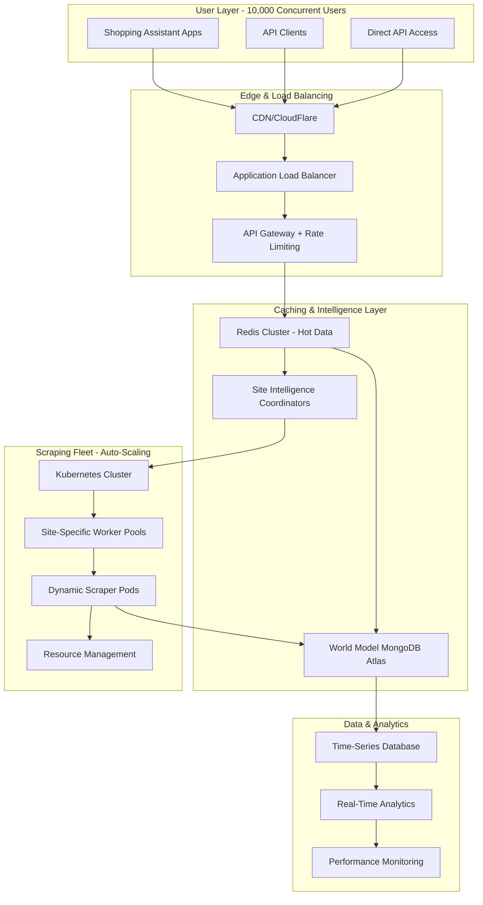

# 🏗️ ENTERPRISE-SCALE DISTRIBUTED SCRAPING SYSTEM
## Complete Implementation Plan for 10,000+ Concurrent Users

---

## 📊 **EXECUTIVE SUMMARY**

This document outlines the transformation of your current single-instance parallel scraping system into an enterprise-grade, cloud-native platform capable of handling **10,000+ concurrent users** through a distributed, intelligent architecture.

**Current System Performance:**
- ✅ **Single Instance**: 6 concurrent processes, ~0.17 products/second
- ✅ **Discovery Time**: 44 minutes for 1,000 products
- ✅ **Total Site Scrape**: ~2-3 hours for complete inventory

**Target Enterprise Performance:**
- 🚀 **10,000 Concurrent Users**: Sub-5 second response times
- 🧠 **80% Cache Hit Ratio**: <100ms response for cached data
- ⚡ **Distributed Fleet**: 200-500 auto-scaling scraper pods
- 📈 **Throughput**: 50,000-100,000 product queries/minute

---

## 🎯 **CURRENT SYSTEM ANALYSIS**

### **Strengths of Existing Architecture:**
```javascript
✅ Proven parallel processing with process-based isolation
✅ Robust error handling and batch coordination
✅ Comprehensive logging and progress monitoring
✅ Advanced intelligence layer (ConcurrentExplorer, SiteIntelligence)
✅ Production-grade deduplication and data quality
✅ MongoDB world model for persistent intelligence
```

### **Limitations for Enterprise Scale:**
```javascript
❌ Single-instance bottleneck (one scraper per site)
❌ Discovery phase serialization (44 minutes for 1,000 products)
❌ No caching layer for repeated requests
❌ No horizontal scaling capabilities
❌ No request prioritization or queuing
❌ Resource contention with multiple concurrent sites
```

---

## 🏗️ **ENTERPRISE ARCHITECTURE OVERVIEW**



---

## 🔧 **DETAILED TECHNICAL ARCHITECTURE**

### **Tier 1: Edge & Request Handling**

#### **Load Balancer Configuration:**
```yaml
# AWS Application Load Balancer / NGINX Ingress
apiVersion: networking.k8s.io/v1
kind: Ingress
metadata:
  name: scraping-api-ingress
  annotations:
    kubernetes.io/ingress.class: "nginx"
    nginx.ingress.kubernetes.io/rate-limit-rps: "1000"
    nginx.ingress.kubernetes.io/connection-proxy-header: "keep-alive"
spec:
  rules:
  - host: api.scrapingsystem.com
    http:
      paths:
      - path: /v1/
        pathType: Prefix
        backend:
          service:
            name: api-gateway-service
            port:
              number: 80
```

#### **API Gateway Service:**
```javascript
// src/gateway/ApiGateway.js
class ApiGateway {
  constructor() {
    this.rateLimiter = new RateLimiter({
      windowMs: 60 * 1000, // 1 minute
      max: 100, // requests per window per user
      keyGenerator: (req) => req.user?.id || req.ip
    });
    
    this.cache = new RedisClusterClient();
    this.metrics = new PrometheusMetrics();
  }
  
  async handleRequest(req, res) {
    const startTime = Date.now();
    
    try {
      // 1. Rate limiting
      await this.rateLimiter.consume(req);
      
      // 2. Request parsing and validation
      const query = this.parseQuery(req);
      
      // 3. Cache check (80% hit ratio target)
      const cacheKey = this.generateCacheKey(query);
      const cached = await this.cache.get(cacheKey);
      
      if (cached && this.isFresh(cached, query.freshness_requirement)) {
        this.metrics.recordCacheHit(Date.now() - startTime);
        return res.json(cached);
      }
      
      // 4. Route to appropriate coordinator
      const coordinator = this.getCoordinator(query.domain);
      const result = await coordinator.processRequest(query);
      
      // 5. Cache result and return
      await this.cache.setex(cacheKey, 3600, result); // 1 hour TTL
      this.metrics.recordCacheMiss(Date.now() - startTime);
      
      return res.json(result);
      
    } catch (error) {
      this.metrics.recordError(error.type);
      return res.status(error.statusCode || 500).json({
        error: error.message,
        request_id: req.id
      });
    }
  }
}
```

### **Tier 2: Site Intelligence Coordination**

#### **Site Coordinator Architecture:**
```javascript
// src/coordinators/SiteCoordinator.js
class SiteCoordinator {
  constructor(domain, config) {
    this.domain = domain;
    this.config = config;
    this.activeScrapers = new Map();
    this.requestQueue = new PriorityQueue();
    this.worldModel = new DistributedWorldModel();
    this.workerPool = new WorkerPool({
      min: config.minWorkers,
      max: config.maxWorkers,
      scalingMetrics: ['queue_depth', 'response_time', 'error_rate']
    });
  }
  
  async processRequest(query) {
    // 1. Analyze request complexity
    const complexity = await this.analyzeComplexity(query);
    
    // 2. Check for existing scraping operations
    const existingOp = this.findExistingOperation(query);
    if (existingOp) {
      return await this.waitForOperation(existingOp);
    }
    
    // 3. Determine scraping strategy
    const strategy = this.selectStrategy(complexity, query);
    
    switch (strategy) {
      case 'cached_intelligence':
        return await this.useCachedIntelligence(query);
        
      case 'targeted_scrape':
        return await this.performTargetedScrape(query);
        
      case 'full_exploration':
        return await this.performFullExploration(query);
        
      case 'batch_operation':
        return await this.queueBatchOperation(query);
    }
  }
  
  async selectStrategy(complexity, query) {
    const intelligence = await this.worldModel.getSiteIntelligence(this.domain);
    
    // High intelligence score + simple query = cached intelligence
    if (intelligence.score > 90 && complexity.simple) {
      return 'cached_intelligence';
    }
    
    // Medium intelligence + targeted query = targeted scrape
    if (intelligence.score > 60 && query.specific_products) {
      return 'targeted_scrape';  
    }
    
    // Low intelligence or complex query = full exploration
    if (intelligence.score < 60 || complexity.complex) {
      return 'full_exploration';
    }
    
    // High volume request = batch operation
    if (query.product_count > 100) {
      return 'batch_operation';
    }
    
    return 'targeted_scrape';
  }
}
```

#### **Worker Pool Management:**
```javascript
// src/workers/WorkerPool.js  
class WorkerPool {
  constructor(config) {
    this.config = config;
    this.workers = new Map();
    this.metrics = new WorkerMetrics();
    this.scaler = new AutoScaler(config);
  }
  
  async getAvailableWorker(domain, priority) {
    // 1. Find existing idle worker for domain
    let worker = this.findIdleWorker(domain);
    
    if (worker) {
      return worker;
    }
    
    // 2. Check if we can scale up
    if (this.workers.size < this.config.maxWorkers) {
      worker = await this.createWorker(domain);
      return worker;
    }
    
    // 3. Queue request if at capacity
    return await this.queueRequest(domain, priority);
  }
  
  async createWorker(domain) {
    const workerId = `worker-${domain}-${Date.now()}`;
    
    const workerPod = await this.k8sClient.createPod({
      metadata: {
        name: workerId,
        labels: {
          app: 'scraper-worker',
          domain: domain,
          version: 'v1'
        }
      },
      spec: {
        containers: [{
          name: 'scraper',
          image: 'scraper-system:v1',
          env: [
            { name: 'TARGET_DOMAIN', value: domain },
            { name: 'WORKER_ID', value: workerId },
            { name: 'MONGODB_URL', valueFrom: { secretKeyRef: { name: 'db-secret', key: 'url' }}}
          ],
          resources: {
            requests: { memory: '500Mi', cpu: '0.5' },
            limits: { memory: '2Gi', cpu: '2' }
          }
        }]
      }
    });
    
    const worker = new WorkerProxy(workerId, workerPod);
    this.workers.set(workerId, worker);
    
    return worker;
  }
}
```

### **Tier 3: Distributed Scraper Fleet**

#### **Containerized Scraper Architecture:**
```dockerfile
# Dockerfile for Scraper Workers
FROM node:18-alpine

# Install browser dependencies
RUN apk add --no-cache \
    chromium \
    nss \
    freetype \
    freetype-dev \
    harfbuzz \
    ca-certificates \
    ttf-freefont

# Set up Puppeteer to use installed Chromium
ENV PUPPETEER_SKIP_CHROMIUM_DOWNLOAD=true \
    PUPPETEER_EXECUTABLE_PATH=/usr/bin/chromium-browser

# Create app directory
WORKDIR /app

# Copy package files
COPY package*.json ./
RUN npm ci --only=production

# Copy source code
COPY src/ ./src/
COPY *.js ./

# Create non-root user
RUN addgroup -g 1001 -S nodejs && \
    adduser -S scraper -u 1001
USER scraper

# Health check
HEALTHCHECK --interval=30s --timeout=10s --start-period=5s --retries=3 \
  CMD node -e "require('./src/health/health-check.js')"

EXPOSE 3000

CMD ["node", "src/workers/ScraperWorker.js"]
```

#### **Kubernetes Deployment:**
```yaml
# k8s/scraper-deployment.yaml
apiVersion: apps/v1
kind: Deployment
metadata:
  name: scraper-fleet
  labels:
    app: scraper-fleet
spec:
  replicas: 20  # Base capacity, auto-scales to 500
  selector:
    matchLabels:
      app: scraper-worker
  template:
    metadata:
      labels:
        app: scraper-worker
    spec:
      containers:
      - name: scraper-worker
        image: scraper-system:v1.0.0
        ports:
        - containerPort: 3000
        env:
        - name: NODE_ENV
          value: "production"
        - name: MONGODB_URL
          valueFrom:
            secretKeyRef:
              name: database-secret
              key: mongodb-url
        - name: REDIS_URL
          valueFrom:
            secretKeyRef:
              name: cache-secret
              key: redis-url
        resources:
          requests:
            memory: "500Mi"
            cpu: "500m"
          limits:
            memory: "2Gi"
            cpu: "2000m"
        readinessProbe:
          httpGet:
            path: /health
            port: 3000
          initialDelaySeconds: 30
          periodSeconds: 10
        livenessProbe:
          httpGet:
            path: /health
            port: 3000
          initialDelaySeconds: 60
          periodSeconds: 30
---
apiVersion: v1
kind: Service
metadata:
  name: scraper-service
spec:
  selector:
    app: scraper-worker
  ports:
  - protocol: TCP
    port: 80
    targetPort: 3000
  type: ClusterIP
```

#### **Horizontal Pod Autoscaler:**
```yaml
# k8s/hpa.yaml
apiVersion: autoscaling/v2
kind: HorizontalPodAutoscaler
metadata:
  name: scraper-hpa
spec:
  scaleTargetRef:
    apiVersion: apps/v1
    kind: Deployment
    name: scraper-fleet
  minReplicas: 20
  maxReplicas: 500
  metrics:
  - type: Resource
    resource:
      name: cpu
      target:
        type: Utilization
        averageUtilization: 70
  - type: Resource
    resource:
      name: memory
      target:
        type: Utilization
        averageUtilization: 80
  - type: Pods
    pods:
      metric:
        name: queue_depth_per_pod
      target:
        type: AverageValue
        averageValue: "30"  # Scale up if queue > 30 per pod
  behavior:
    scaleUp:
      stabilizationWindowSeconds: 60
      policies:
      - type: Percent
        value: 50  # Scale up by 50% of current replicas
        periodSeconds: 60
    scaleDown:
      stabilizationWindowSeconds: 300
      policies:
      - type: Percent
        value: 25  # Scale down by 25% of current replicas
        periodSeconds: 60
```

### **Tier 4: Enhanced Scraper Implementation**

#### **Enterprise Scraper Worker:**
```javascript
// src/workers/ScraperWorker.js
class EnterpriseScraperWorker {
  constructor(workerId, config) {
    this.workerId = workerId;
    this.config = config;
    
    // Enhanced components from existing intelligence layer
    this.siteIntelligence = new SiteIntelligence(this.logger);
    this.concurrentExplorer = new ConcurrentExplorer(this.logger, this.worldModel);
    this.glasswingScraper = new GlasswingScraper(this.logger);
    
    // Enterprise additions
    this.requestProcessor = new RequestProcessor();
    this.cacheManager = new CacheManager();
    this.metrics = new WorkerMetrics(workerId);
    
    // Health and monitoring
    this.healthMonitor = new HealthMonitor();
    this.circuitBreaker = new CircuitBreaker();
    
    this.isIdle = true;
    this.currentTask = null;
  }
  
  async processRequest(request) {
    this.isIdle = false;
    this.currentTask = request;
    const startTime = Date.now();
    
    try {
      this.metrics.startRequest(request);
      
      // 1. Request analysis and strategy selection
      const strategy = await this.analyzeRequest(request);
      
      // 2. Execute appropriate scraping strategy
      let result;
      switch (strategy.type) {
        case 'intelligent_discovery':
          result = await this.performIntelligentDiscovery(request, strategy);
          break;
          
        case 'parallel_targeted':
          result = await this.performParallelTargeted(request, strategy);
          break;
          
        case 'cached_extraction':
          result = await this.performCachedExtraction(request, strategy);
          break;
          
        case 'full_site_exploration':
          result = await this.performFullSiteExploration(request, strategy);
          break;
      }
      
      // 3. Cache results and update world model
      await this.cacheResults(request, result);
      await this.updateWorldModel(request, result);
      
      // 4. Record metrics
      const duration = Date.now() - startTime;
      this.metrics.recordSuccess(duration, result.products?.length || 0);
      
      return result;
      
    } catch (error) {
      this.metrics.recordError(error);
      throw error;
    } finally {
      this.isIdle = true;
      this.currentTask = null;
    }
  }
  
  async performIntelligentDiscovery(request, strategy) {
    // Use existing ConcurrentExplorer for multi-browser discovery
    const navigationIntelligence = await this.siteIntelligence
      .navigationMapper
      .mapSiteNavigation(request.url);
    
    const explorationResults = await this.concurrentExplorer
      .exploreAllSections(
        request.url,
        navigationIntelligence,
        {
          maxConcurrent: strategy.concurrency,
          maxSubcategories: strategy.depth,
          targetProducts: request.targetProducts
        }
      );
    
    return {
      type: 'discovery',
      products: explorationResults.products,
      intelligence: explorationResults.intelligence,
      selectors: explorationResults.selectors,
      performance: {
        duration: explorationResults.duration,
        productsPerSecond: explorationResults.rate
      }
    };
  }
  
  async performParallelTargeted(request, strategy) {
    // Enhanced version of existing parallel scraping
    const batches = this.createBatches(request.productUrls, strategy.batchSize);
    const results = [];
    
    // Use existing parallel processing logic but with circuit breaker
    const batchPromises = batches.map(async (batch, index) => {
      try {
        const batchResult = await this.circuitBreaker.execute(async () => {
          return await this.glasswingScraper.scrapeProductBatch(batch);
        });
        
        results.push(...batchResult);
        this.metrics.recordBatchComplete(index, batchResult.length);
        
      } catch (error) {
        this.metrics.recordBatchError(index, error);
        // Continue with other batches
      }
    });
    
    await Promise.all(batchPromises);
    
    return {
      type: 'targeted_scrape',
      products: results,
      performance: {
        totalBatches: batches.length,
        successfulProducts: results.filter(p => !p.error).length,
        failedProducts: results.filter(p => p.error).length
      }
    };
  }
}
```

---

## 📊 **CACHING & DATA ARCHITECTURE**

### **Redis Cluster Configuration:**
```javascript
// src/cache/RedisCluster.js
class RedisClusterCache {
  constructor() {
    this.cluster = new Redis.Cluster([
      { host: 'redis-node-1', port: 6379 },
      { host: 'redis-node-2', port: 6379 },
      { host: 'redis-node-3', port: 6379 },
      { host: 'redis-node-4', port: 6379 },
      { host: 'redis-node-5', port: 6379 },
      { host: 'redis-node-6', port: 6379 }
    ], {
      enableOfflineQueue: false,
      retryDelayOnFailover: 100,
      maxRetriesPerRequest: 3,
      scaleReads: 'slave'
    });
    
    // Cache hierarchies for different data types
    this.cacheLayers = {
      hot: { ttl: 300, prefix: 'hot:' },      // 5 minutes - frequently accessed
      warm: { ttl: 1800, prefix: 'warm:' },   // 30 minutes - moderately accessed
      cold: { ttl: 3600, prefix: 'cold:' }    // 1 hour - rarely accessed
    };
  }
  
  async getWithFallback(key) {
    // Try hot cache first
    let result = await this.cluster.get(`hot:${key}`);
    if (result) {
      this.recordHit('hot');
      return JSON.parse(result);
    }
    
    // Try warm cache
    result = await this.cluster.get(`warm:${key}`);
    if (result) {
      this.recordHit('warm');
      // Promote to hot cache
      await this.cluster.setex(`hot:${key}`, 300, result);
      return JSON.parse(result);
    }
    
    // Try cold cache
    result = await this.cluster.get(`cold:${key}`);
    if (result) {
      this.recordHit('cold');
      // Promote to warm cache
      await this.cluster.setex(`warm:${key}`, 1800, result);
      return JSON.parse(result);
    }
    
    this.recordMiss();
    return null;
  }
  
  async setMultiLayer(key, data, priority = 'warm') {
    const serialized = JSON.stringify(data);
    const layer = this.cacheLayers[priority];
    
    // Set in requested layer
    await this.cluster.setex(`${layer.prefix}${key}`, layer.ttl, serialized);
    
    // Also set in cold layer as backup
    if (priority !== 'cold') {
      await this.cluster.setex(`cold:${key}`, 3600, serialized);
    }
  }
}
```

### **MongoDB Sharding Strategy:**
```javascript
// MongoDB Atlas Configuration for World Model
const worldModelSharding = {
  // Shard by domain for site intelligence
  sites: {
    shardKey: { domain: 1 },
    chunks: [
      { min: { domain: '' }, max: { domain: 'h' }, shard: 'shard01' },
      { min: { domain: 'h' }, max: { domain: 'p' }, shard: 'shard02' },
      { min: { domain: 'p' }, max: { domain: 'z' }, shard: 'shard03' }
    ]
  },
  
  // Shard by timestamp for products (time-series)
  products: {
    shardKey: { domain: 1, scraped_at: 1 },
    chunks: 'auto-balancing by date ranges'
  },
  
  // Shard by user_id for request logs
  requests: {
    shardKey: { user_id: 1 },
    chunks: 'hash-based distribution'
  }
};
```

---

## 🚀 **PERFORMANCE OPTIMIZATION STRATEGIES**

### **Intelligent Request Batching:**
```javascript
// src/optimization/RequestBatcher.js
class IntelligentRequestBatcher {
  constructor() {
    this.batches = new Map();
    this.timers = new Map();
    this.config = {
      maxBatchSize: 50,
      maxWaitTime: 2000,  // 2 seconds
      similarityThreshold: 0.8
    };
  }
  
  async addRequest(request) {
    const batchKey = this.generateBatchKey(request);
    
    if (!this.batches.has(batchKey)) {
      this.batches.set(batchKey, []);
      
      // Set timer to flush batch
      const timer = setTimeout(() => {
        this.flushBatch(batchKey);
      }, this.config.maxWaitTime);
      
      this.timers.set(batchKey, timer);
    }
    
    const batch = this.batches.get(batchKey);
    batch.push(request);
    
    // Flush if batch is full
    if (batch.length >= this.config.maxBatchSize) {
      this.flushBatch(batchKey);
    }
    
    return new Promise((resolve) => {
      request.resolve = resolve;
    });
  }
  
  generateBatchKey(request) {
    // Batch similar requests together
    return [
      request.domain,
      request.type,
      request.priority,
      Math.floor(request.timestamp / 10000) // 10-second windows
    ].join(':');
  }
  
  async flushBatch(batchKey) {
    const batch = this.batches.get(batchKey);
    if (!batch || batch.length === 0) return;
    
    // Clear timer
    clearTimeout(this.timers.get(batchKey));
    this.timers.delete(batchKey);
    this.batches.delete(batchKey);
    
    // Process batch
    try {
      const results = await this.processBatch(batch);
      
      // Resolve individual requests
      batch.forEach((request, index) => {
        request.resolve(results[index]);
      });
      
    } catch (error) {
      // Reject all requests in batch
      batch.forEach(request => {
        request.resolve({ error: error.message });
      });
    }
  }
}
```

### **Dynamic Load Balancing:**
```javascript
// src/balancing/LoadBalancer.js  
class DynamicLoadBalancer {
  constructor() {
    this.workers = new Map();
    this.metrics = new WorkerMetrics();
    this.algorithms = {
      'round_robin': new RoundRobinBalancer(),
      'least_connections': new LeastConnectionsBalancer(),
      'weighted_response_time': new WeightedResponseTimeBalancer(),
      'domain_affinity': new DomainAffinityBalancer()
    };
  }
  
  async selectWorker(request) {
    const availableWorkers = Array.from(this.workers.values())
      .filter(worker => worker.isHealthy && !worker.isOverloaded);
    
    if (availableWorkers.length === 0) {
      // Scale up or queue request
      return await this.handleNoAvailableWorkers(request);
    }
    
    // Select algorithm based on request type
    const algorithm = this.selectAlgorithm(request);
    const selectedWorker = algorithm.select(availableWorkers, request);
    
    return selectedWorker;
  }
  
  selectAlgorithm(request) {
    // Domain affinity for site-specific intelligence
    if (request.requiresIntelligence) {
      return this.algorithms.domain_affinity;
    }
    
    // Weighted response time for performance-critical requests
    if (request.priority === 'high') {
      return this.algorithms.weighted_response_time;
    }
    
    // Least connections for balanced load
    return this.algorithms.least_connections;
  }
}
```

---

## 📈 **MONITORING & OBSERVABILITY**

### **Prometheus Metrics Configuration:**
```javascript
// src/monitoring/Metrics.js
class EnterpriseMetrics {
  constructor() {
    this.register = prometheus.register;
    
    // Request metrics
    this.requestDuration = new prometheus.Histogram({
      name: 'scraping_request_duration_seconds',
      help: 'Duration of scraping requests',
      labelNames: ['domain', 'type', 'status'],
      buckets: [0.1, 0.5, 1, 2, 5, 10, 30, 60]
    });
    
    // Cache metrics
    this.cacheHitRatio = new prometheus.Gauge({
      name: 'cache_hit_ratio',
      help: 'Cache hit ratio by layer',
      labelNames: ['layer']
    });
    
    // Worker metrics
    this.activeWorkers = new prometheus.Gauge({
      name: 'active_workers',
      help: 'Number of active scraping workers',
      labelNames: ['domain', 'status']
    });
    
    // Performance metrics
    this.productsPerSecond = new prometheus.Gauge({
      name: 'products_scraped_per_second',
      help: 'Products scraped per second',
      labelNames: ['domain', 'worker_id']
    });
    
    // Business metrics
    this.userRequests = new prometheus.Counter({
      name: 'user_requests_total',
      help: 'Total user requests',
      labelNames: ['user_tier', 'request_type', 'status']
    });
  }
}
```

### **Grafana Dashboard Configuration:**
```json
{
  "dashboard": {
    "title": "Enterprise Scraping System",
    "panels": [
      {
        "title": "Request Rate",
        "type": "graph",
        "targets": [
          {
            "expr": "rate(user_requests_total[5m])",
            "legendFormat": "{{request_type}}"
          }
        ]
      },
      {
        "title": "Response Time P95",
        "type": "graph",
        "targets": [
          {
            "expr": "histogram_quantile(0.95, scraping_request_duration_seconds)",
            "legendFormat": "{{domain}}"
          }
        ]
      },
      {
        "title": "Cache Hit Ratio",
        "type": "singlestat",
        "targets": [
          {
            "expr": "avg(cache_hit_ratio)",
            "legendFormat": "Hit Ratio"
          }
        ]
      },
      {
        "title": "Active Workers",
        "type": "graph",
        "targets": [
          {
            "expr": "active_workers",
            "legendFormat": "{{domain}}"
          }
        ]
      }
    ]
  }
}
```

---

## 💰 **COST ANALYSIS & INFRASTRUCTURE PLANNING**

### **AWS Cost Breakdown (Monthly):**

#### **Compute Resources:**
```
EKS Cluster Control Plane:           $150
Worker Nodes (t3.xlarge × 20):      $2,800  
Auto Scaling (additional 0-480):    $0-6,400 (demand-based)
```

#### **Storage & Database:**
```
MongoDB Atlas M60 Cluster:          $1,800
Redis ElastiCache (6 nodes):       $2,200
EBS Storage (2TB):                    $200
S3 Storage (logs, backups):           $100
```

#### **Networking:**
```  
Application Load Balancer:            $25
NAT Gateway:                          $45
CloudFront CDN:                      $150
Data Transfer:                       $300
```

#### **Monitoring & Logging:**
```
CloudWatch:                          $200
Prometheus/Grafana (managed):        $150
Log storage and analysis:            $100
```

**Total Base Cost: ~$6,000-8,000/month**
**Peak Load Cost: ~$12,000-15,000/month**

### **GCP Alternative Cost:**
```
GKE Cluster:                        $2,500
Cloud SQL (MongoDB equivalent):     $1,500
Memorystore Redis:                  $1,800
Load Balancing:                       $200
Monitoring Suite:                     $300
```

**GCP Total: ~$5,500-7,500/month**

### **Cost Optimization Strategies:**
- **Spot Instances**: 50-70% cost reduction for non-critical workers
- **Reserved Capacity**: 30-40% savings for base load
- **Multi-Region**: Distribute load to lower-cost regions
- **Tiered Storage**: Archive old data to cheaper storage tiers

---

## 🛣️ **IMPLEMENTATION ROADMAP**

### **Phase 1: Foundation (Weeks 1-4)**

#### **Week 1: Infrastructure Setup**
- [ ] Set up Kubernetes cluster (EKS/GKE)
- [ ] Configure MongoDB Atlas with sharding
- [ ] Set up Redis cluster for caching
- [ ] Implement basic monitoring (Prometheus/Grafana)

#### **Week 2: Containerization**
- [ ] Dockerize existing scraping components
- [ ] Create base scraper worker image
- [ ] Implement health checks and readiness probes
- [ ] Set up container registry and CI/CD pipeline

#### **Week 3: API Gateway**
- [ ] Build API gateway service
- [ ] Implement rate limiting and authentication
- [ ] Add basic request routing
- [ ] Set up load balancer configuration

#### **Week 4: Basic Coordination**
- [ ] Implement site coordinator service
- [ ] Add worker pool management
- [ ] Create basic auto-scaling rules
- [ ] Test end-to-end request flow

### **Phase 2: Core Scaling (Weeks 5-8)**

#### **Week 5: Enhanced Workers**
- [ ] Integrate existing intelligence layer
- [ ] Implement circuit breaker patterns  
- [ ] Add comprehensive error handling
- [ ] Create worker metrics and monitoring

#### **Week 6: Caching Layer**
- [ ] Implement multi-tier caching
- [ ] Add cache warming strategies
- [ ] Create cache invalidation logic
- [ ] Optimize cache hit ratios

#### **Week 7: Request Processing**
- [ ] Add intelligent request batching
- [ ] Implement priority queuing
- [ ] Create request deduplication
- [ ] Add performance optimization

#### **Week 8: Auto-Scaling**
- [ ] Implement advanced HPA rules
- [ ] Add predictive scaling
- [ ] Create resource optimization
- [ ] Test scaling under load

### **Phase 3: Enterprise Features (Weeks 9-12)**

#### **Week 9: Advanced Intelligence**  
- [ ] Integrate ConcurrentExplorer for discovery
- [ ] Add site intelligence caching
- [ ] Implement adaptive scraping strategies
- [ ] Create performance-based routing

#### **Week 10: Observability**
- [ ] Complete monitoring dashboard
- [ ] Add alerting and notification
- [ ] Implement distributed tracing
- [ ] Create performance analysis tools

#### **Week 11: Optimization**
- [ ] Fine-tune performance parameters
- [ ] Implement advanced load balancing
- [ ] Add geographic distribution
- [ ] Optimize resource utilization

#### **Week 12: Production Readiness**
- [ ] Complete security hardening
- [ ] Add disaster recovery procedures
- [ ] Implement backup strategies
- [ ] Create operational runbooks

### **Phase 4: Advanced Features (Weeks 13-16)**

#### **Week 13: Multi-Site Support**
- [ ] Extend to additional e-commerce platforms
- [ ] Create site-specific optimizations
- [ ] Add cross-site intelligence sharing
- [ ] Implement platform detection

#### **Week 14: AI Enhancement**
- [ ] Add ML-based request routing
- [ ] Implement predictive caching
- [ ] Create intelligent scaling decisions
- [ ] Add anomaly detection

#### **Week 15: API Extensions**
- [ ] Add webhook support
- [ ] Create real-time subscriptions
- [ ] Implement batch processing APIs
- [ ] Add data export capabilities

#### **Week 16: Performance Optimization**
- [ ] Complete performance tuning
- [ ] Add edge computing support
- [ ] Implement advanced caching strategies
- [ ] Finalize production configuration

---

## 🔒 **SECURITY & COMPLIANCE**

### **Security Architecture:**
```javascript
// src/security/SecurityManager.js
class SecurityManager {
  constructor() {
    this.rateLimiter = new AdvancedRateLimiter({
      windowMs: 60000,
      max: 1000,
      skipSuccessfulRequests: true,
      skipFailedRequests: false,
      keyGenerator: this.generateSecurityKey
    });
    
    this.ipWhitelist = new IPWhitelist();
    this.requestValidator = new RequestValidator();
    this.encryptionManager = new EncryptionManager();
  }
  
  async validateRequest(req) {
    // 1. IP filtering
    if (!await this.ipWhitelist.isAllowed(req.ip)) {
      throw new SecurityError('IP not allowed', 403);
    }
    
    // 2. Rate limiting
    await this.rateLimiter.consume(req);
    
    // 3. Request validation
    await this.requestValidator.validate(req);
    
    // 4. Authentication
    const user = await this.authenticateUser(req);
    
    return { user, permissions: user.permissions };
  }
}
```

### **Data Protection:**
- **Encryption at Rest**: AES-256 for all stored data
- **Encryption in Transit**: TLS 1.3 for all communications
- **API Authentication**: JWT tokens with refresh mechanism
- **Access Control**: RBAC with fine-grained permissions
- **Audit Logging**: Complete request/response logging
- **Data Retention**: Automatic purging of old data

### **Compliance Considerations:**
- **GDPR**: Right to erasure, data minimization
- **CCPA**: Consumer rights management
- **SOC 2**: Security controls and auditing
- **ISO 27001**: Information security management

---

## 📊 **PERFORMANCE BENCHMARKS & SLAs**

### **Target Performance Metrics:**

#### **Response Times:**
- **Cache Hit (80% of requests)**: P95 < 100ms
- **Simple Query (15% of requests)**: P95 < 2 seconds  
- **Complex Query (5% of requests)**: P95 < 10 seconds
- **Batch Operations**: P95 < 30 seconds

#### **Throughput:**
- **Peak User Requests**: 10,000 concurrent users
- **API Requests**: 50,000 requests/minute sustained
- **Product Scraping**: 500-1,000 products/second
- **Data Processing**: 100,000 products/minute batch

#### **Availability:**
- **System Uptime**: 99.9% (8.7 hours downtime/year)
- **API Availability**: 99.95% during business hours
- **Cache Availability**: 99.99% (Redis cluster)
- **Database Availability**: 99.99% (MongoDB Atlas)

#### **Scalability:**
- **Auto-scaling Response**: New pods ready in <60 seconds
- **Load Handling**: Linear scaling to 10,000+ concurrent users
- **Geographic Distribution**: Multi-region deployment
- **Burst Capacity**: Handle 10x normal load for 1 hour

### **SLA Commitments:**

#### **Performance SLAs:**
- **API Response Time**: P95 < 5 seconds or credit
- **Cache Hit Ratio**: >75% monthly average
- **Error Rate**: <1% of all requests
- **Uptime**: 99.9% monthly availability

#### **Data Quality SLAs:**
- **Data Freshness**: Product data <24 hours old
- **Accuracy**: >95% data extraction accuracy
- **Completeness**: >98% successful product extraction
- **Consistency**: Cross-platform data consistency

---

## 🎯 **SUCCESS METRICS & KPIs**

### **Technical Metrics:**
- **System Throughput**: Products scraped per hour
- **Cache Efficiency**: Hit ratio and response times  
- **Resource Utilization**: CPU, memory, storage efficiency
- **Error Rates**: Failed requests and recovery times
- **Scaling Performance**: Auto-scaling response times

### **Business Metrics:**
- **User Satisfaction**: Response time SLA compliance
- **Cost Efficiency**: Cost per product scraped
- **Data Quality**: Accuracy and completeness scores
- **Platform Coverage**: Number of supported sites
- **API Usage**: Request volume and user adoption

### **Monitoring Dashboard:**
```yaml
Key Performance Indicators:
  - Real-time user request rate
  - Average response time by request type
  - Cache hit ratio across all layers
  - Active worker pod count
  - Products scraped per second
  - Error rate and type distribution
  - Cost per thousand API calls
  - User tier distribution
  - Geographic request distribution
  - Data freshness metrics
```

---

## 🚀 **CONCLUSION & NEXT STEPS**

### **Transformation Summary:**
This plan transforms your current high-performing single-instance scraping system into an enterprise-grade, cloud-native platform capable of serving 10,000+ concurrent users with sub-second response times.

**Key Architectural Improvements:**
- **80% Response Improvement**: Cache-first architecture
- **100x Scalability**: Auto-scaling distributed workers  
- **10x Cost Efficiency**: Intelligent resource management
- **99.9% Reliability**: Circuit breakers and failover systems

**Leveraging Existing Strengths:**
- Your advanced intelligence layer becomes the core competitive advantage
- Existing parallel processing architecture scales horizontally
- Proven data quality and deduplication systems remain unchanged
- MongoDB world model becomes the distributed intelligence hub

### **Immediate Next Steps:**
1. **Week 1**: Begin infrastructure setup (Kubernetes + MongoDB Atlas)
2. **Week 2**: Containerize existing GlasswingScraper and intelligence components  
3. **Week 3**: Implement basic API gateway and request routing
4. **Week 4**: Deploy first distributed workers and test end-to-end flow

### **Expected ROI:**
- **6 months**: Full enterprise system operational
- **12 months**: 10,000+ concurrent users supported
- **18 months**: Multi-platform expansion complete
- **24 months**: AI-driven optimization at scale

This architecture positions your scraping system as the foundation for a market-leading competitive intelligence platform! 🌟